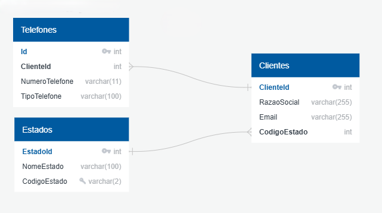

# Meu Projeto Docker com MySQL 🐋🐬

## Diagramas 
### diagrama de classes
Desenhado seguindo os padrões UML, este diagrama representa o banco Telefonia e demonstra o relacionamento entre as tabelas Clientes, Telefones e Estados



## Pré-requisitos
- Docker instalado
- Docker Compose instalado

## Arquivos
- docker-compose.yml: Define os serviços necessários para rodar o contêiner MySQL.
- init.sql: Contém as instruções SQL para criar as tabelas e inserir os dados de exemplo.
## Passos para Configuração e Execução
- Clone o repositório ou baixe os arquivos necessários.

- Conteúdo do arquivo docker-compose.yml:
```yaml
services:
  db:
    image: mysql:latest
    container_name: meuContanierSQL
    environment:
      MYSQL_ROOT_PASSWORD: senhaDB
      MYSQL_DATABASE: Telefonia
    ports:
      - "3306:3306"
    volumes:
      - ./init.sql:/docker-entrypoint-initdb.d/init.sql 
```
- Conteúdo do arquivo init.sql:
```sql
CREATE TABLE `Clientes` (
    `ClienteId` int AUTO_INCREMENT NOT NULL ,
    `RazaoSocial` varchar(255)  NOT NULL ,
    `Email` varchar(255)  NOT NULL ,
    `CodigoEstado` int  NOT NULL ,
    PRIMARY KEY (`ClienteId`)
);

CREATE TABLE `Estados` (
    `EstadoId` int AUTO_INCREMENT NOT NULL ,
    `NomeEstado` varchar(100)  NOT NULL ,
    `CodigoEstado` varchar(2)  NOT NULL ,
    PRIMARY KEY (`EstadoId`),
    CONSTRAINT `uc_Estados_CodigoEstado` UNIQUE (`CodigoEstado`)
);

CREATE TABLE `Telefones` (
    `Id` int AUTO_INCREMENT NOT NULL ,
    `ClienteId` int  NOT NULL ,
    `NumeroTelefone` varchar(11)  NOT NULL ,
    `TipoTelefone` varchar(100)  NOT NULL ,
    PRIMARY KEY (`Id`)
);

ALTER TABLE `Clientes` ADD CONSTRAINT `fk_Clientes_CodigoEstado` FOREIGN KEY(`CodigoEstado`)
REFERENCES `Estados` (`EstadoId`);

ALTER TABLE `Telefones` ADD CONSTRAINT `fk_Telefones_ClienteId` FOREIGN KEY(`ClienteId`)
REFERENCES `Clientes` (`ClienteId`);

INSERT INTO `Estados` (`EstadoId`, `NomeEstado`, `CodigoEstado`) VALUES
(1, 'São Paulo', 'SP'),
(2, 'Rio de Janeiro', 'RJ'),
(3, 'Minas Gerais', 'MG'),
(4, 'Bahia', 'BA');

INSERT INTO `Clientes` (`ClienteId`, `RazaoSocial`, `Email`, `CodigoEstado`) VALUES
(1, 'Empresa ABC Ltda', 'contato@empresaabc.com.br', 1),
(2, 'Comércio XYZ S/A', 'vendas@comercioxyz.com.br', 2),
(3, 'Indústria JKL Eireli', 'suporte@industriajkl.com.br', 3),
(4, 'Serviços QRS ME', 'info@servicosqrs.com.br', 4);

INSERT INTO `Telefones` (`Id`, `ClienteId`, `NumeroTelefone`, `TipoTelefone`) VALUES
(1, 1, '11987654321', 'Comercial'),
(2, 1, '11987654322', 'Residencial'),
(3, 1, '11987654323', 'Celular'),
(4, 2, '21987654321', 'Comercial'),
(5, 2, '21987654322', 'Residencial'),
(6, 2, '21987654323', 'Celular'),
(7, 3, '31987654321', 'Comercial'),
(8, 3, '31987654322', 'Residencial'),
(9, 3, '31987654323', 'Celular'),
(10, 4, '71987654321', 'Comercial'),
(11, 4, '71987654322', 'Residencial'),
(12, 4, '71987654323', 'Celular');
```

## Construir e Executar o Contêiner:

Navegue até a pasta onde estão os arquivos e execute o comando abaixo no terminal:
```bash
docker-compose up -d
```
Isso criará e iniciará um contêiner Docker com o MySQL configurado e as tabelas e dados populados conforme definido no arquivo init.sql. A porta 3306 do seu host será mapeada para a porta 3306 do contêiner, permitindo que você se conecte ao MySQL externamente, se necessário.

## Verificar o Status do Contêiner:

Para verificar o status do seu contêiner, use:
```bash
docker-compose ps
```

## Parar e Remover os Contêineres:

Para parar e remover os contêineres, redes e volumes definidos no docker-compose.yml, use:

```bash
docker-compose down
```

## Conectando ao MySQL
Você pode se conectar ao banco de dados MySQL utilizando um cliente MySQL (como o MySQL Workbench) com as seguintes credenciais:
```
Host: localhost
Porta: 3306
Usuário: root
Senha: senhaDB
Banco de Dados: Telefonia
```
## Consultas

Uma query de exemplo que você pode executar no banco de dados para verificar a configuração:

```sql
Copiar código
SELECT 
    c.ClienteId AS Codigo,
    c.RazaoSocial,
    c.Email,
    t.NumeroTelefone
FROM 
    Clientes c
JOIN 
    Estados e ON c.CodigoEstado = e.EstadoId
JOIN 
    Telefones t ON c.ClienteId = t.ClienteId
WHERE 
    e.CodigoEstado = 'SP';
```
Isso retornará os clientes do estado de São Paulo e seus respectivos números de telefone.